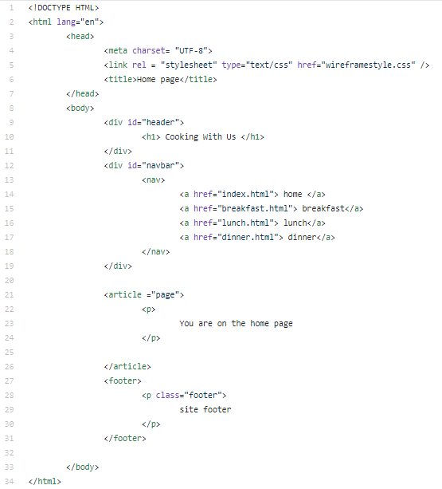
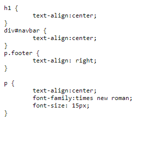
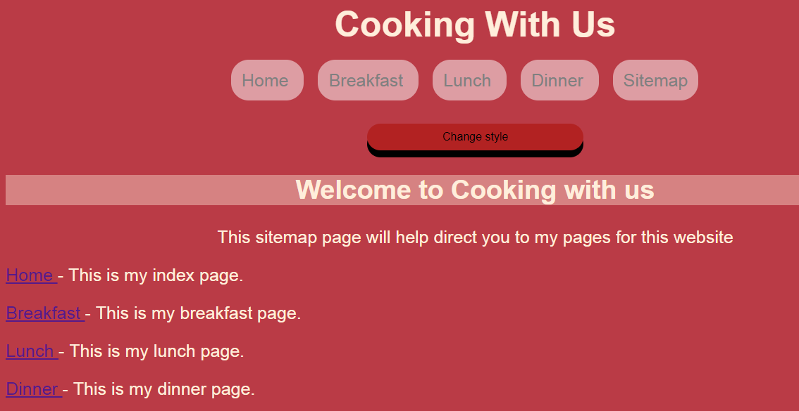
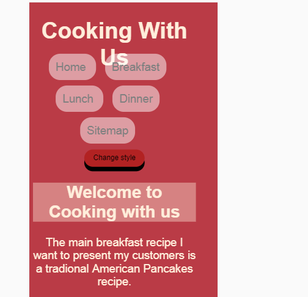

# CTEC-3905-website

below is an image of my wireframe. This gives you a rough example of how the website will plan out. 

Below is a screenshot of my wireframe CSS.

Below is an image showing my header

This is what happens when the user clicks "change style"

This is how my sitemap looks so the user can view each page. 

Below is how my site will look when used on an IPhone 7. 

However, looking at the image you can see it could have been a little more responsive. But I am happy that my buttons are far apart enough for the user to see each page. 
